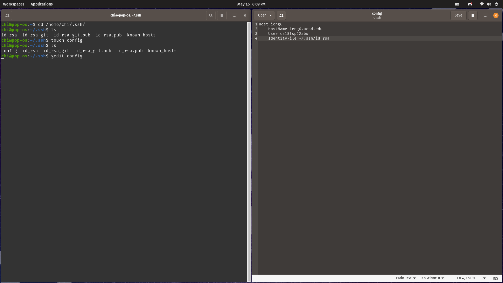
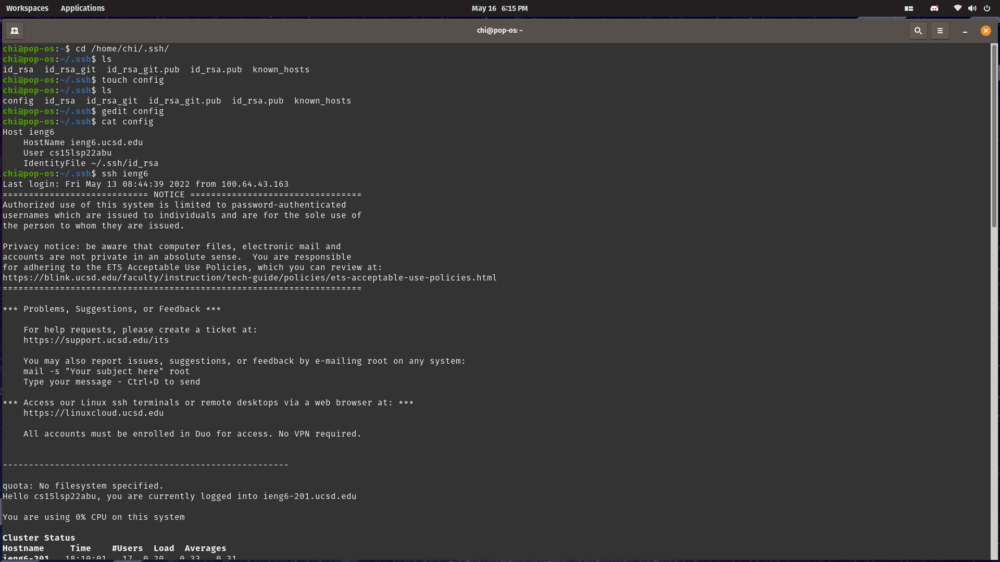
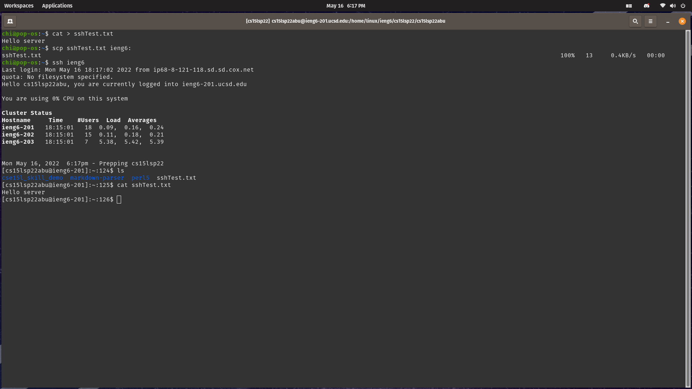
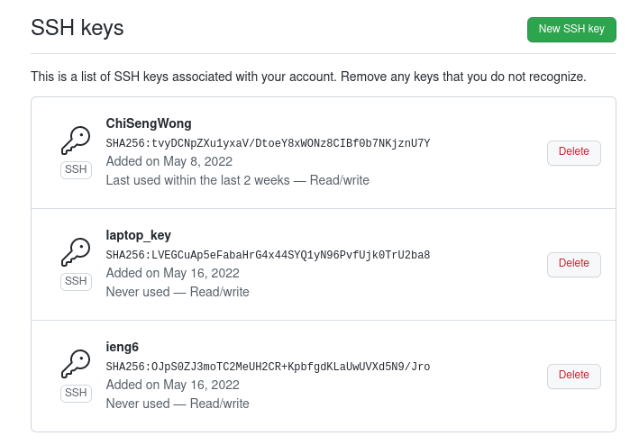
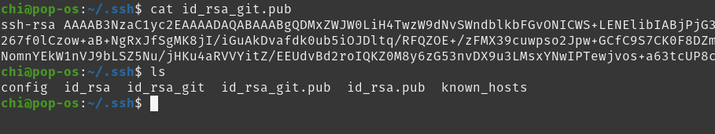
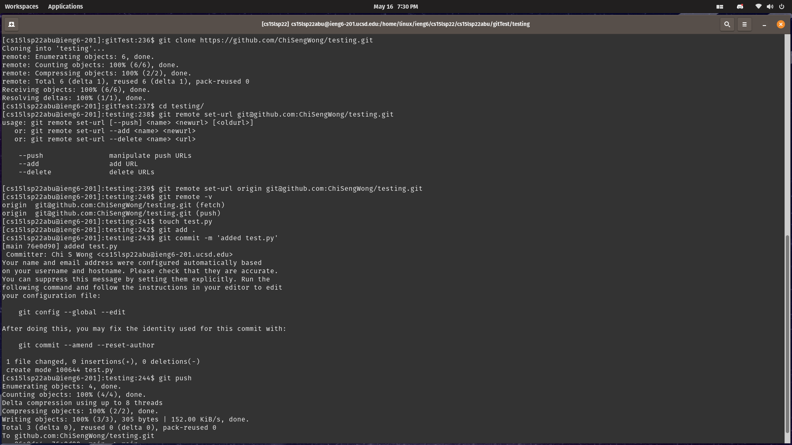
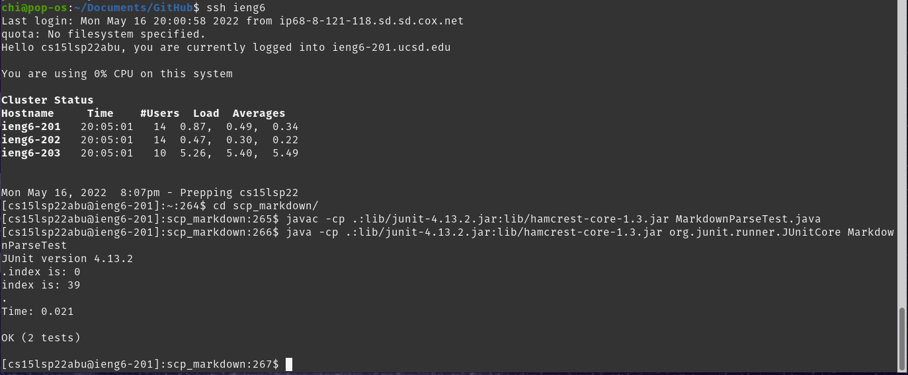
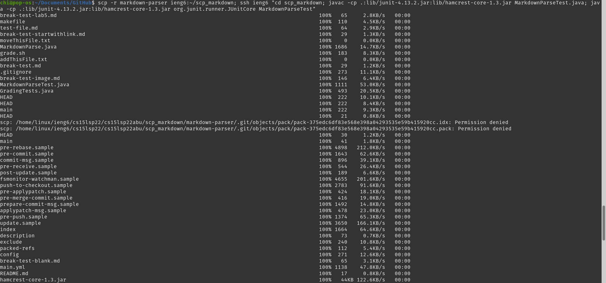

# Streamlining ssh Configuration
<br>

In order to be more efficiently connecting to a remote server and avoid typing the whole account name every time using `ssh` command. We can modify `~/.ssh/config` to set a shorter andd easier to remember username for each server account.
<br>
the SSH configuration file may not exist by default, if that is the case, use `touch` command to create the file.
```
$ touch ~/.ssh/config
```
## **`.ssh/config` file and how to edit it.**

After we created the configuration file or the file already exist, we may put an entry in it to name a server. We can use `gedit` command to open and edit the config file. The lines added should follow similar structure.
```
Host ieng6
    HostName ieng6.ucsd.edu
    User cs15lsp22abu
    IdentityFile ~/.ssh/id_rsa
```


## **`ssh` command logging into account using just the alias**

After adding in the lines, we should be able to log to the server with our given name.

## **copying file to account with `scp` command using just alias**
We may also copy file to remote account quicker using the alias.


# Setup Github Access from ieng6
Github had removed its support for password authentication, which means user can heonly use a token-based login mechanism like SSH keys.<br>
We can use `ssh-keygen` command to generate a new key on our local computer, and link the public key to github.com.
```
~/.ssh$ cat [your_key].pub 
```
Display the public key on the terminal using the above command and copy the content.<br>
After that, go to https://github.com/settings/ssh/new, and paste the public key to key section, then press [Add SSH Key]<br>
## **public key stored on Github**

## **public and private key is stored on user account**


After adding the public key to github.com, we should be able to check if the connection is successful using the command
```
$ ssh git@github.com
```
if it result in an Error indicating that `> Permission denied (publickey).`
We could try using the following command 
```
$ eval `ssh-agent -s`
> [Agent info]
$ ssh-add [path_to_private_key] 
```
to make sure the key is being used.

If the conection is successful, `ssh git@github.com` should return something similar to
```
> Hi [username]! You've successfully authenticated...but GitHub does not provide shell access...

```
## **Running git commands while logged into ieng6 account**

## **Link for the commit**
[commit_link](https://github.com/ChiSengWong/testing/commits/main/test.py)


# Copy whole directories with scp -r
In order to copy an unempty directories, we could recursively `scp` a directory using `-r` keyword.
The syntax is similar to regualr `scp` command.
```
$ scp -r [directory_to_copy] [remote_account]:~/[new_directory_name]
```
## **Copying markdown-parse to ieng6**


## **Compiling and running tests in ieng6**

## **Combining `scp`, `;` and `ssh` to copy the whole directory and run the tests in one line.**
