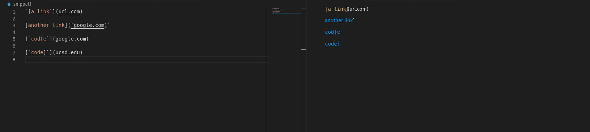
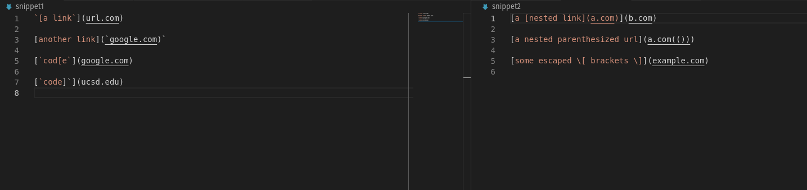
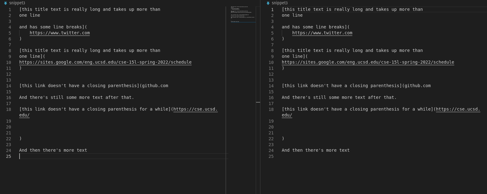
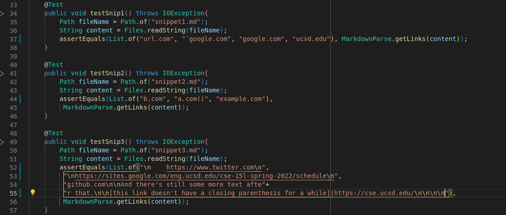
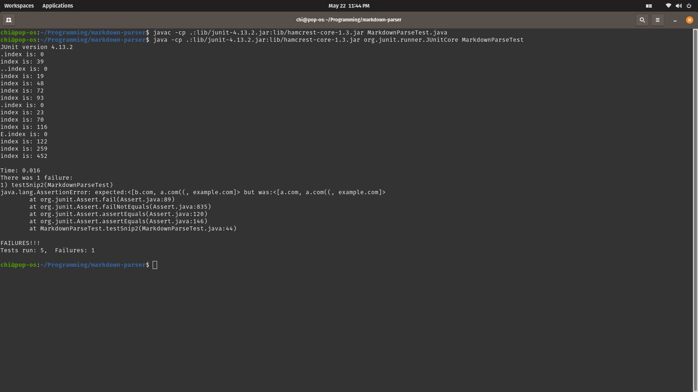
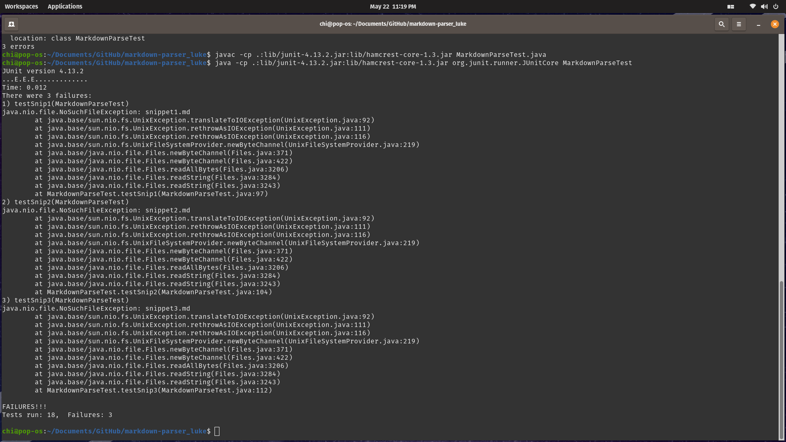

## Snippet1

## Snippet2

## Snippet3

## TestCase

## Links to repo

[Our Implementation](https://github.com/mrreganwang/markdown-parser)

[The other group's implementation](https://github.com/Luke-Sheltraw/markdown-parser)

## Our test result

## Other group's test result

## Code Change questions
In our implementation, we passed two test, which is snippet1 and snippet3, but we failed at snippet2.

In the other group's implementation, all three tests failed.

In snippet1, the function ignored all backticks by searching only for openBracket-closeBracket pairs, then openParen-closeParen pairs, and get whatever within the two paren as link.

In snippet2, our implementation failed because of nested brackets within brakcets.
To fix the bug with small code change, we only have to add a if statement to ensure closeBracket is the last bracket before the next link pattern ( '' pattern).

In snippet3, the function also searhcing only for desired pairs, thus newline characters does not affect its output. For extra characters at the end, the function ignore extra text if one of the pair is not found.