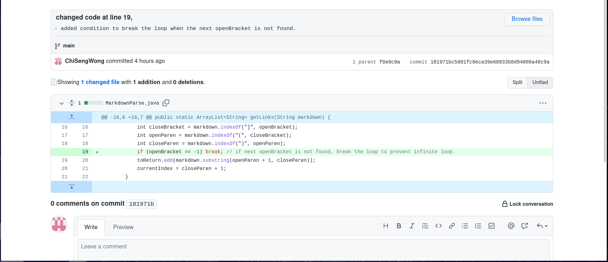
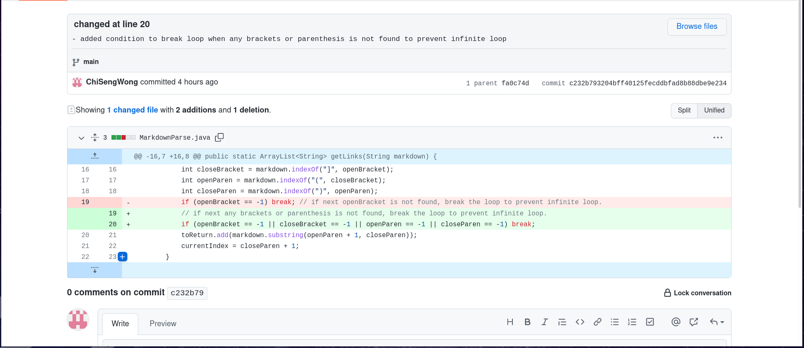
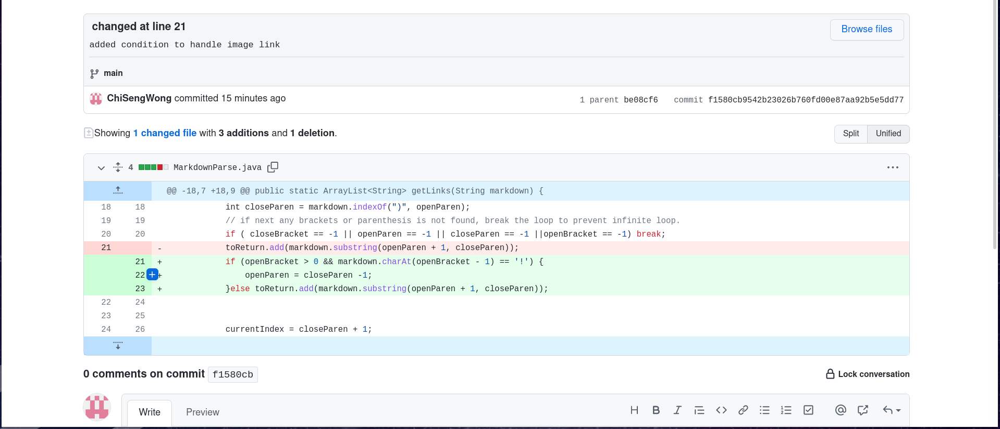

[link_to_test1](lab3/test-file.md) 
output: 
``chi@pop-os:~/Programming/markdown-parser$ java MarkdownParse "test-file.md``  
``>>> chi@pop-os:~/Programming/markdown-parser$          `` 
 
the bug is that ``getLinks()`` method in ``MarkdownParse`` class only set currentIndex to one index after
the last found closing parenthesis, which could not handle cases that there exist other characters after the last found
closing parenthesis.  
The failure-inducing input is ``test-file.md`` where an empty line exist after the last found 
parenthesis. Thus causing infinite loop within the method as symptom and did not return anything. 

[link_to_test2](lab3/break_test2.md) 
output: 
``chi@pop-os:~/Programming/markdown-parser$ java MarkdownParse "break_test.md``  
``>>> chi@pop-os:~/Programming/markdown-parser$          `` 
the bug is that the previous change on ``getLinks()`` method in ``MarkdownParse`` class only handle bugs that caused by
not finding the next opening bracket, but do not handle condition that some of the open-closing brackets or open-closing
parenthesis found and some were missing. 
The failure-inducing input is ``break_test2.md`` where a open-closing brackets pair is found, but the following 
open-closing parenthesis were not found. Thus causing infinite loop within the method as symptom and did not return anything. 

[link_to_test](lab3/break_test.md) 
output: 
``chi@pop-os:~/Programming/markdown-parser$ java MarkdownParse "break_test.md``  
``>>> [https://something.com, some-thing.html, amazing-Img.png]`` 
the bug is that ``getLinks()`` method in ``MarkdownParse`` class only does not handle image links cases, which does not
suppose to be returned as regular link. 
The failure-inducing input is ``break_test.md`` where exist an image link.
Thus causing the method to return also the link for the image. 
